# 学生就业管理系统

 
---
### 👉作者QQ ：1556708905 微信：zheng0123Long (支持定制修改、部署调试、定制毕设)

### 👉接网站建设、小程序、H5、APP、各种系统等

---

#### 介绍
基于Javaweb开发的学生就业管理系统，学生就业管理系统有三个角色：管理员、企业、学生，对学生信息管理、企业信息管理、求职信息管理，满足毕业涉及以及高校来管理学生就业信息。  

#### 软件架构
后端架构：spring | springmvc | mybatis  
前端架构：jsp | layui  
系统环境：jdk1.8 | maven | mysql  

#### 功能介绍
##### 【代码结构与数据库截图】
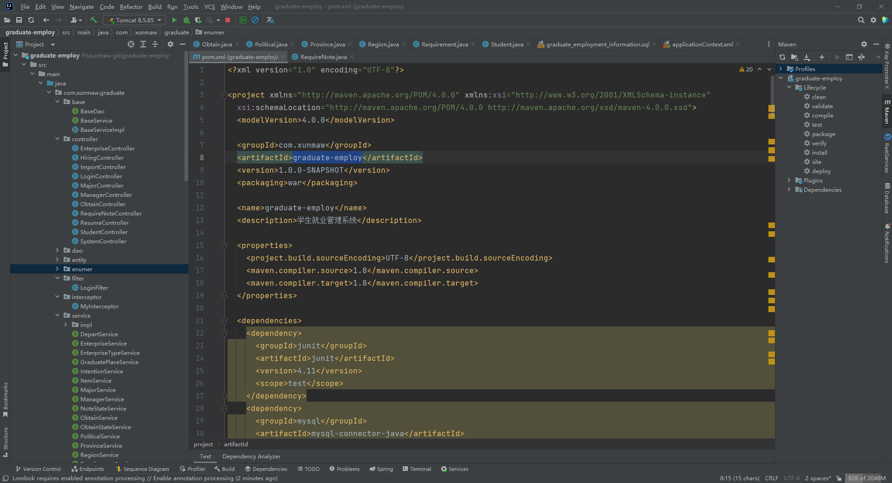 
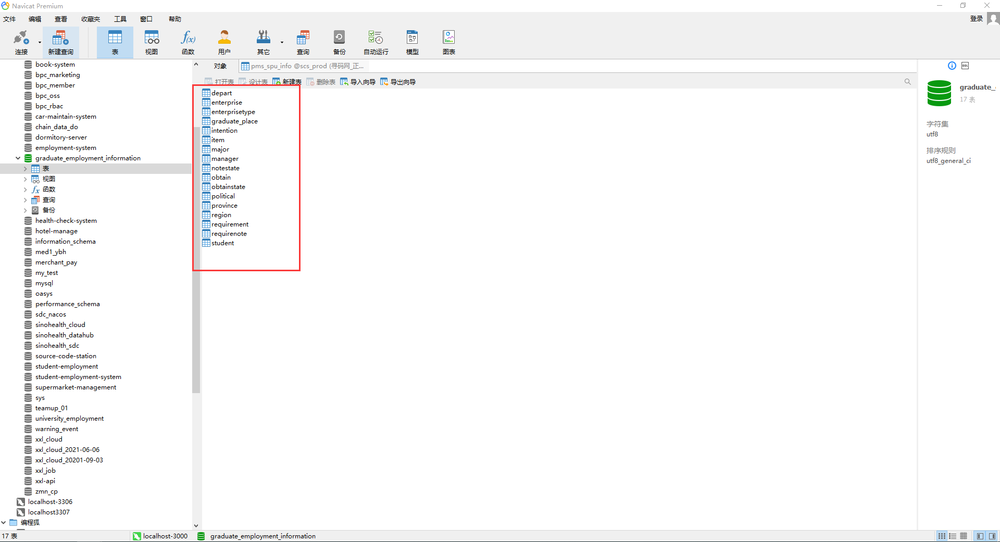

##### 【功能详述】 
 1. 登录  
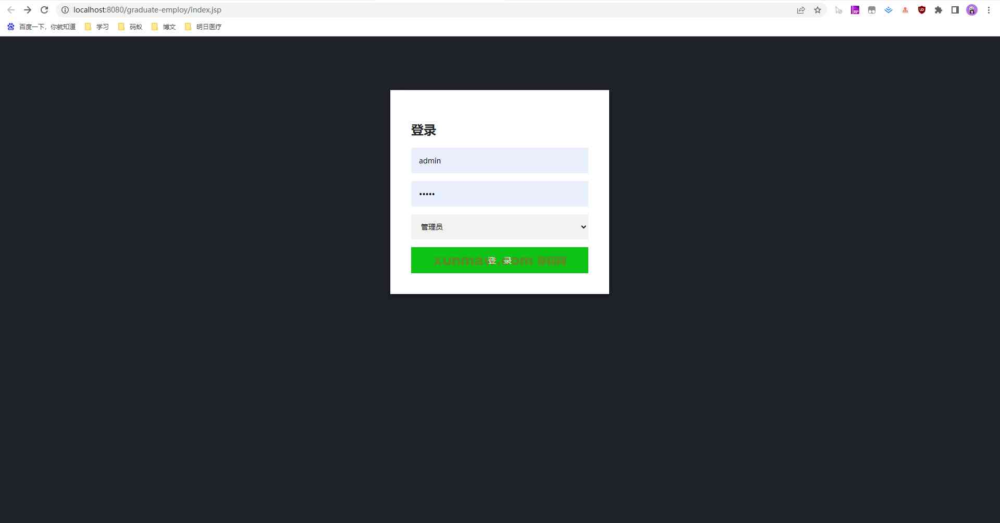

 2. 首页  

 3. 学生信息管理  
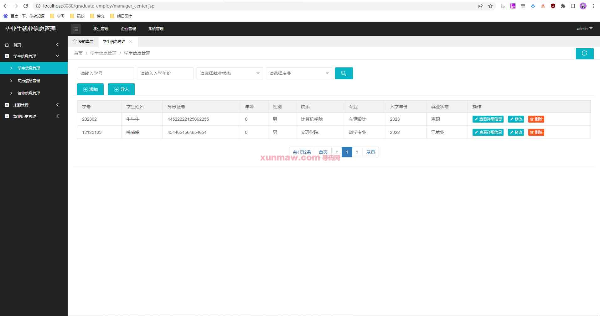

 4. 简历信息管理  
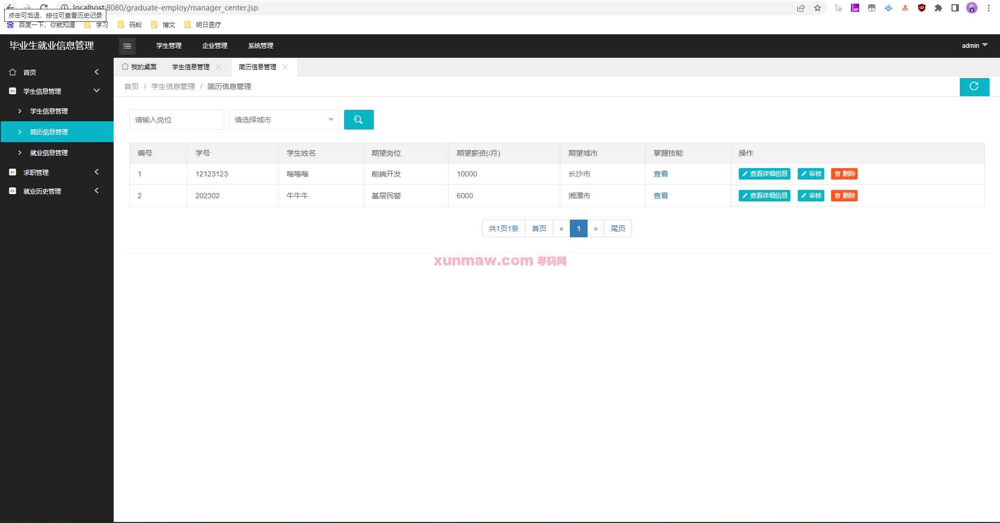

 5. 就业信息管理  
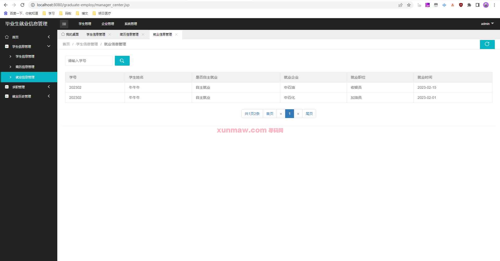

 6. 求职列表管理  
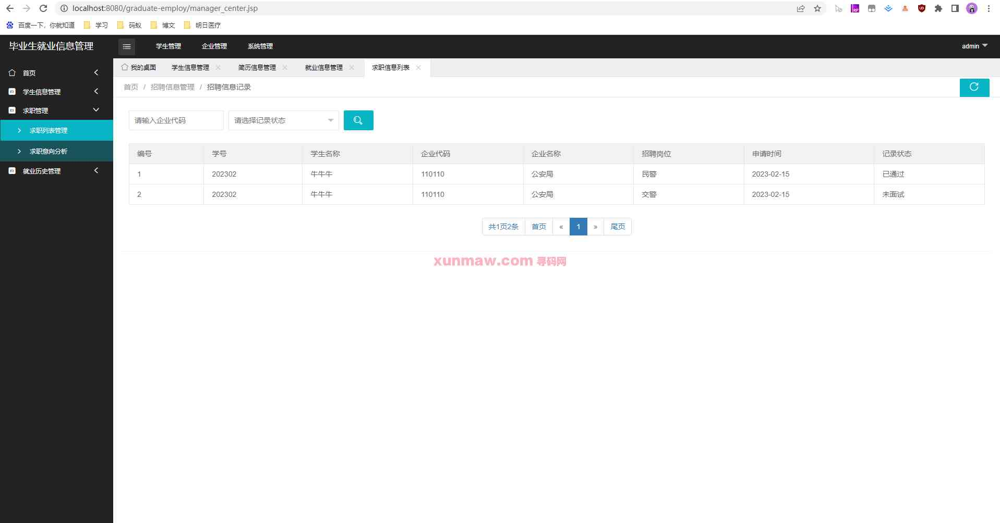

 7. 求职意向分析  
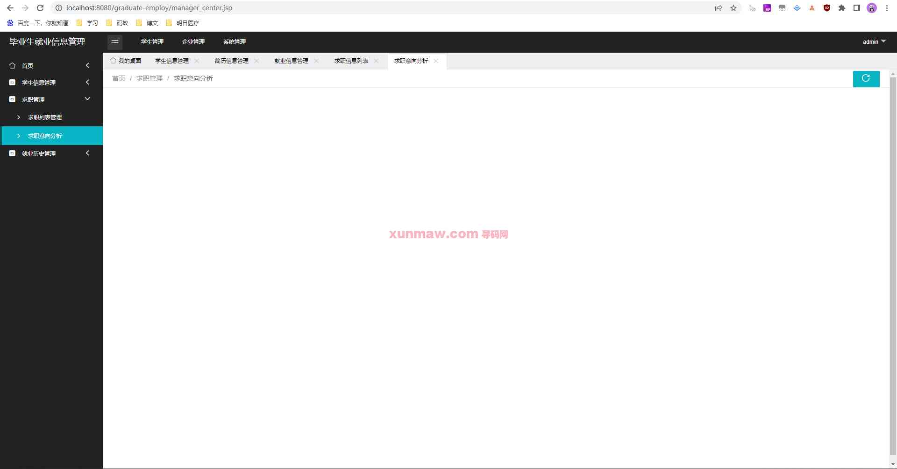

 8. 毕业生信息管理  
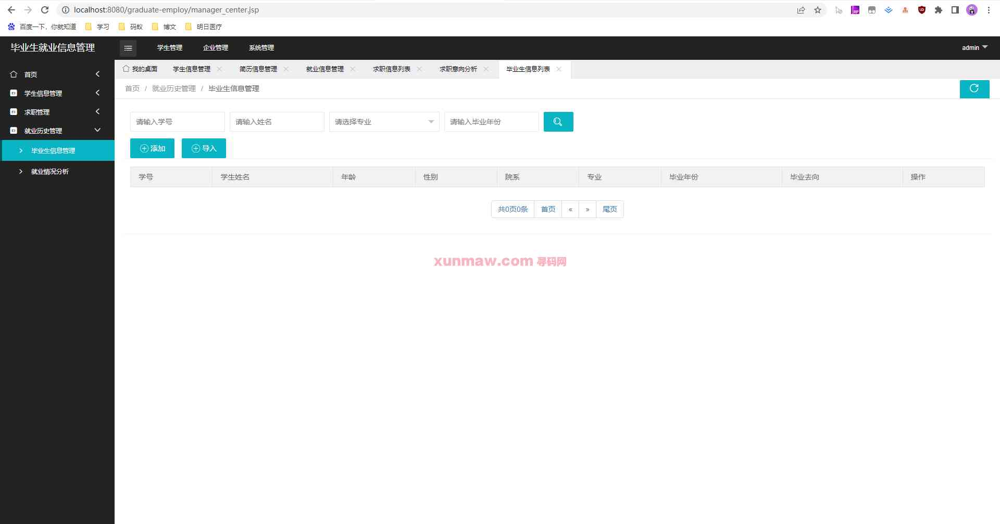

 9. 就业情况分析  
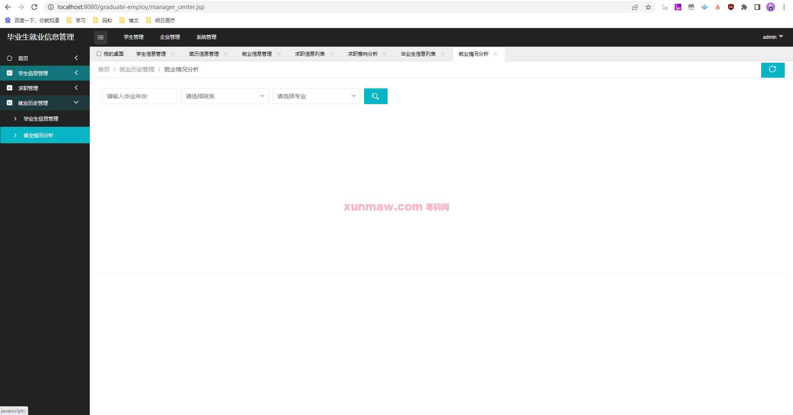

 10. 企业信息管理  
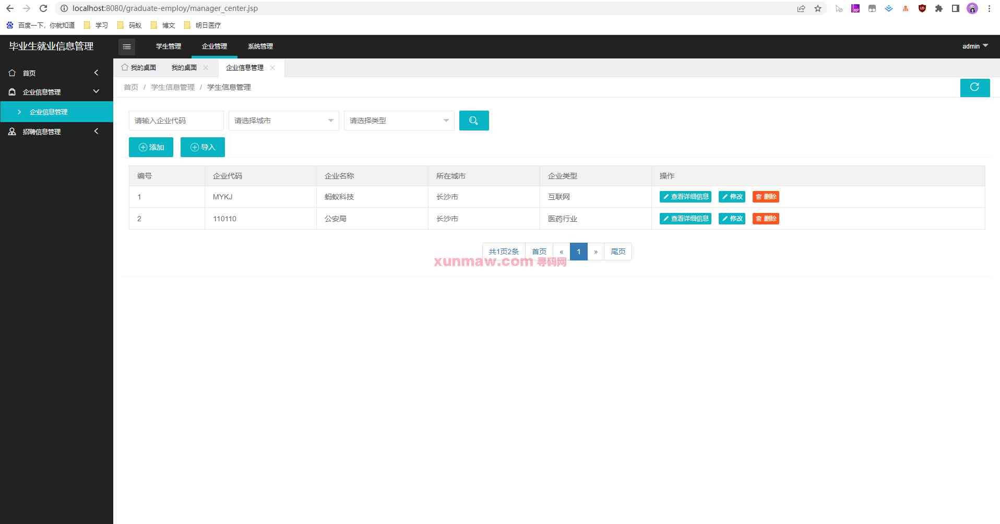

 11. 招聘信息管理  
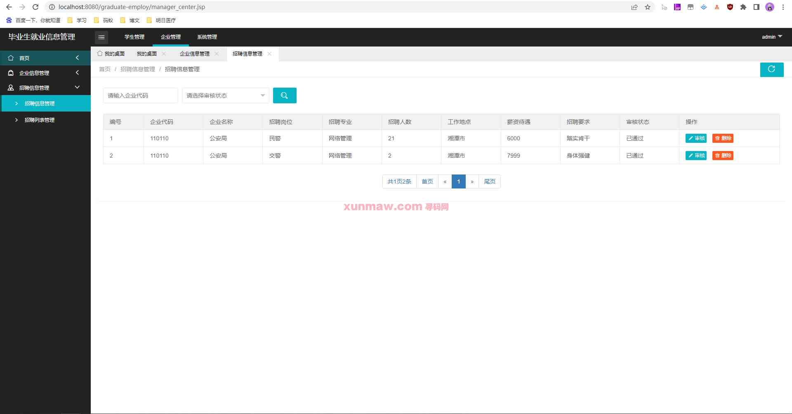

 12. 省份管理  
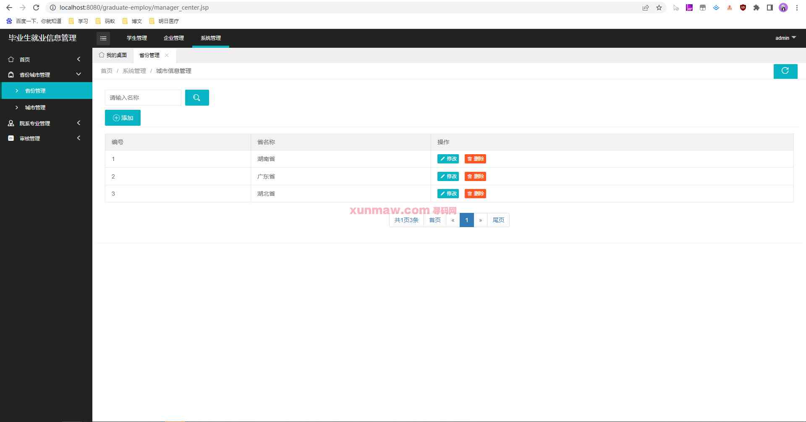

 13. 城市管理  
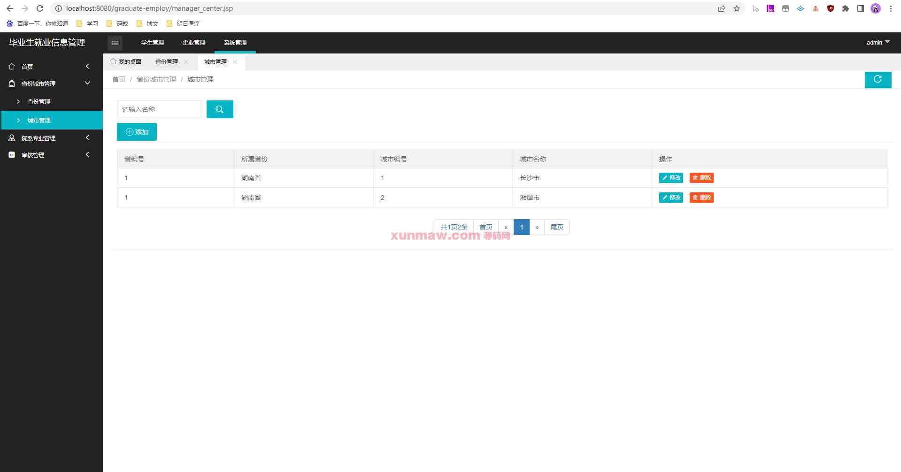

 14. 院校管理  
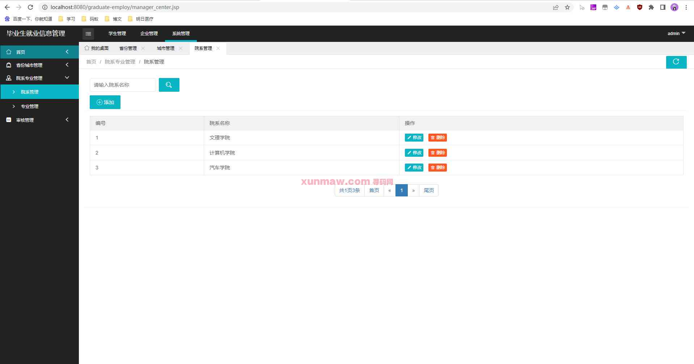

 15. 专业管理  
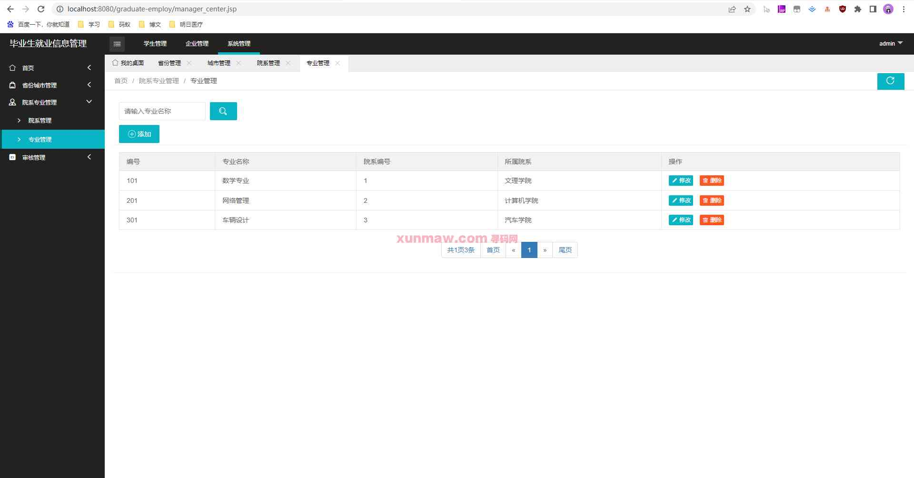

 16. 招聘信息审核  
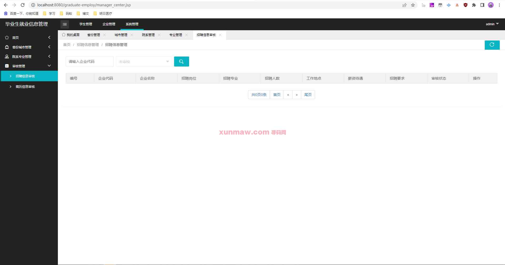

 17. 简历信息审核  
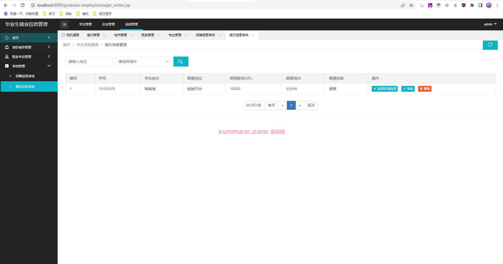

#### 使用说明
1. 创建数据库，执行数据库脚本  
2. 修改jdbc数据库连接参数  
3. 下载安装maven依赖jar  
4. 启动tomcat部署项目  

请求地址：  
    http://localhost:8081/graduate-employ  
    admin    
    123456  